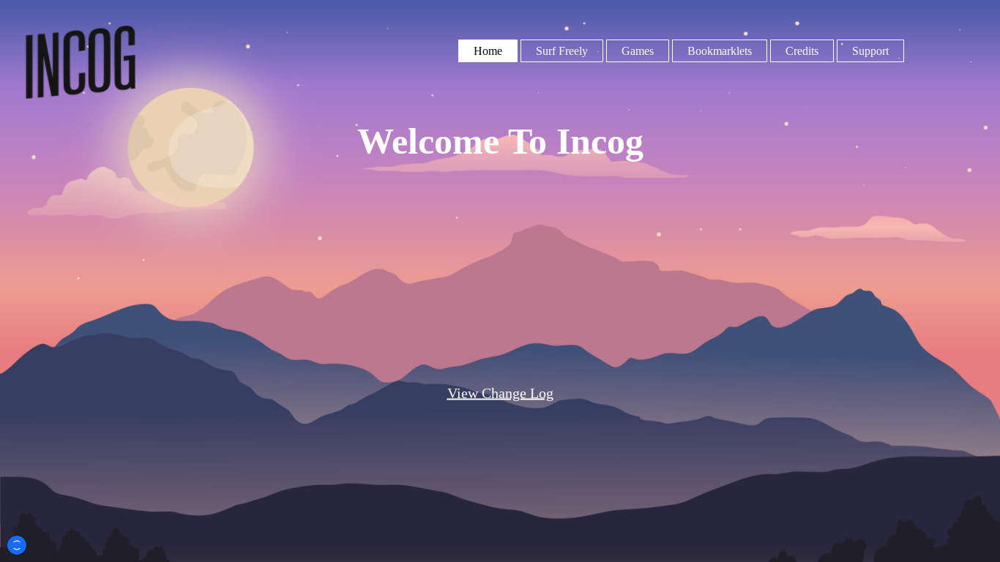
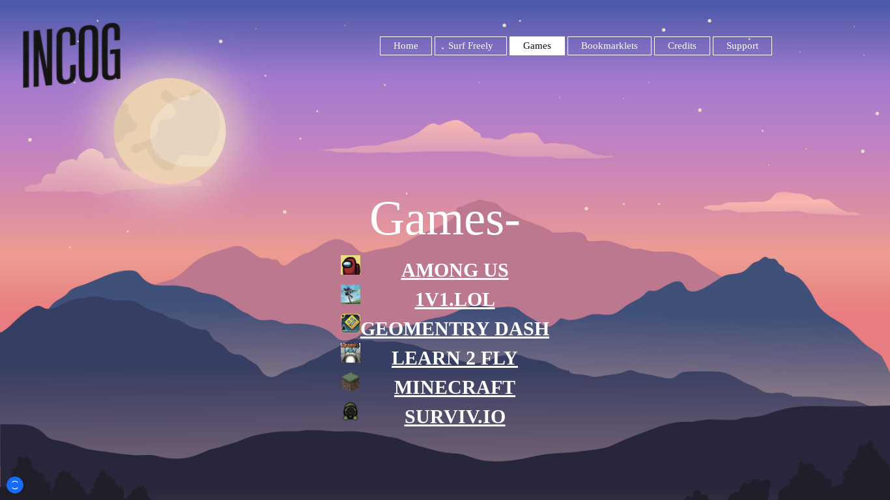

<h1>Incog</h1>

* [About](#about)
* [Future](#future)
* [Deploying](#deploying)
* [Copyright](#copyright)

# About
Incog is a proxy/gaming website where we want to help you bypass school restrictions and let have fun in class. We offer multiple built in proxies to bypass blocked websites and we offer games for you to play with friends during class

# Future
In the future I would definitly want to get more games on the site. I would also hope to be able to add more proxies to the site

# Deploying
Making a copy of this site is really easy. Just click on the  button below and it will deploy your site automaticly

<stong>You may have to mess with the surf.js file to get the proxies to work</strong>

# Copyright
While some people don't allow any code stolen I am ok if you steal a little bit of code. <strong>HOWEVER</strong>, I am not ok if you take <strong>MY CODE</strong> and claim it as yours.
